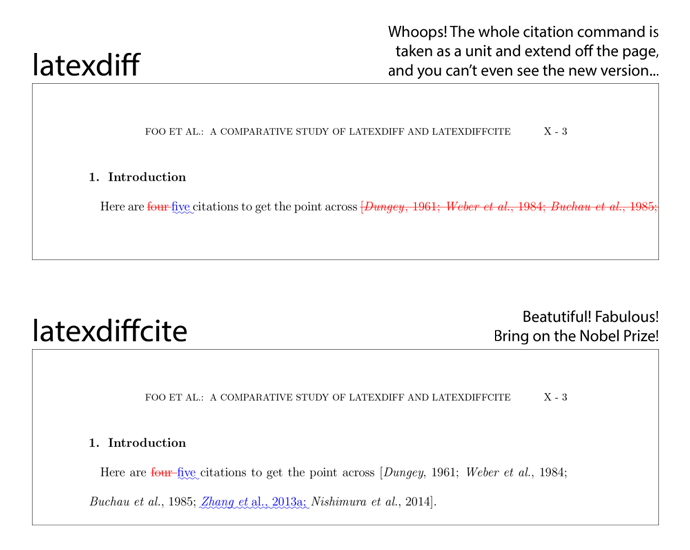

| |docs| |version| |downloads| |supported-versions|
| |travis| |appveyor| |codecov| |landscape| |scrutinizer|

.. |docs| image:: https://readthedocs.org/projects/latexdiffcite/badge/?style=flat
    :target: https://readthedocs.org/projects/latexdiffcite
    :alt: Documentation Status

.. |version| image:: http://img.shields.io/pypi/v/latexdiffcite.svg?style=flat
    :alt: PyPI Package latest release
    :target: https://pypi.python.org/pypi/latexdiffcite

.. |downloads| image:: http://img.shields.io/pypi/dm/latexdiffcite.svg?style=flat
    :alt: PyPI Package monthly downloads
    :target: https://pypi.python.org/pypi/latexdiffcite

.. |supported-versions| image:: https://pypip.in/py_versions/latexdiffcite/badge.svg?style=flat
    :alt: Supported versions
    :target: https://pypi.python.org/pypi/latexdiffcite

.. |travis| image:: http://img.shields.io/travis/cmeeren/latexdiffcite/master.svg?style=flat
    :alt: Travis-CI Build Status
    :target: https://travis-ci.org/cmeeren/latexdiffcite

.. |appveyor| image:: https://ci.appveyor.com/api/projects/status/github/cmeeren/latexdiffcite?branch=master
    :alt: AppVeyor Build Status
    :target: https://ci.appveyor.com/project/cmeeren/latexdiffcite

.. |codecov| image:: http://img.shields.io/codecov/c/github/cmeeren/latexdiffcite/master.svg?style=flat
    :alt: Coverage Status
    :target: https://codecov.io/github/cmeeren/latexdiffcite

.. |landscape| image:: https://landscape.io/github/cmeeren/latexdiffcite/master/landscape.svg?style=flat
    :target: https://landscape.io/github/cmeeren/latexdiffcite/master
    :alt: Code Quality Status

.. |scrutinizer| image:: https://img.shields.io/scrutinizer/g/cmeeren/latexdiffcite/master.svg?style=flat
    :alt: Scrutinizer Status
    :target: https://scrutinizer-ci.com/g/cmeeren/latexdiffcite/

|

What is `latexdiffcite`?
========================

`latexdiffcite` is a wrapper around `latexdiff` to make citations diff properly:

`latexdiffcite` is a wrapper around `latexdiff` which, before calling `latexdiff`, replaces (in temporary files!) citation commands such as ``\cite{...}`` with written-out formatted references. It does this by looking up references in a corresponding ``.bib`` file or ``.bbl`` file and formatting them according to a user-specifiable configuration. `latexdiff` will then properly mark changes in the citations. The citation format can be heavily customized to match what you are already getting from LaTeX/BibTeX.

`latexdiff` is a great tool for highlighting changes in LaTeX documents. Unfortunately, when you use citation commands such as ``\cite{...}`` in your document, two annoying problems occur:

1. The whole citation command is treated as a single entity, which means that if you add or remove references in a citation command, the whole old line of references ``[Foo, 2013; Bar, 2012]`` is marked as removed and the whole new line of references ``[Foo, 2013; Bar, 2012; Baz, 2014]`` is marked as inserted, even though only a single reference was changed.
2. Both the old and new references are rendered without linebreaks (in `latexdiff`'s default underline/strikethrough style) and may easily extend way off the page if there are many references in the citation command.

`latexdiffcite` aims to rectify this by replacing all citation commands in the files with written-out references in plain text before running `latexdiff`. For example, ``\citep{foo2013, bar2012}`` might be replaced by ``[\textit{Foo}, 2013; \textit{Bar et~al.}, 2012]``. The format can be customized. Temporary files are used; the original files are kept intact.

Contents
--------

.. toctree::
    :maxdepth: 2

    self
    quickstart
    installation
    usage
    configuration
    config_examples/index
    contributing
    authors
    changelog
